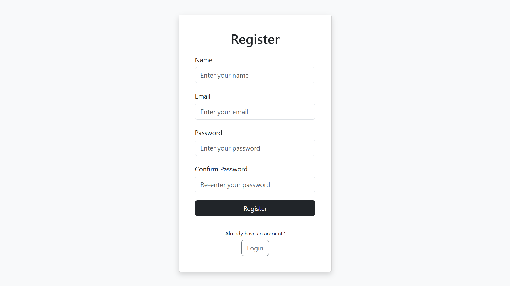
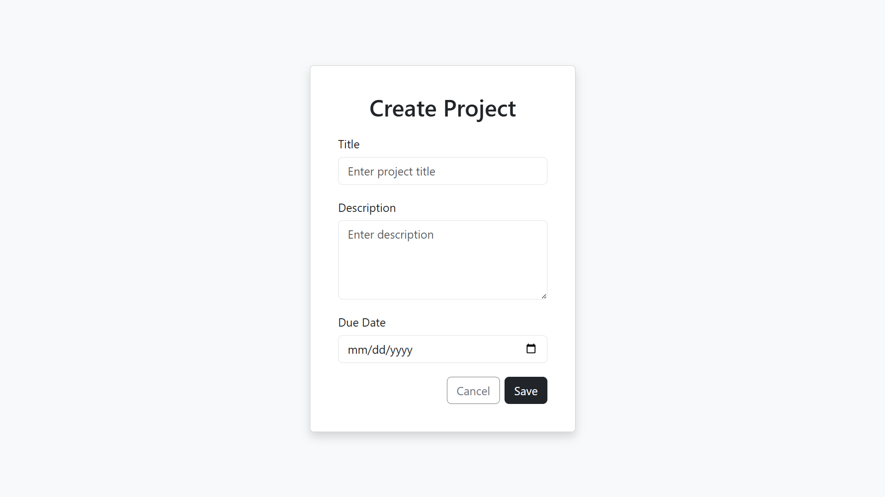
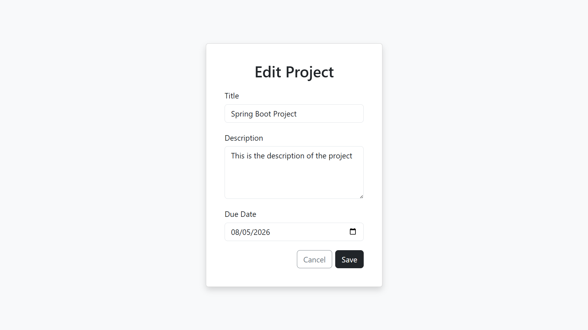
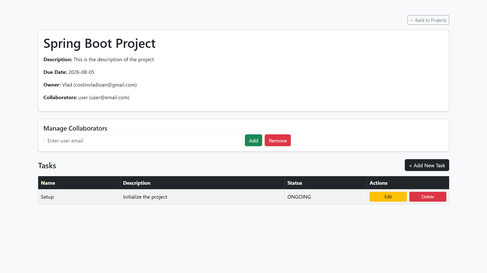
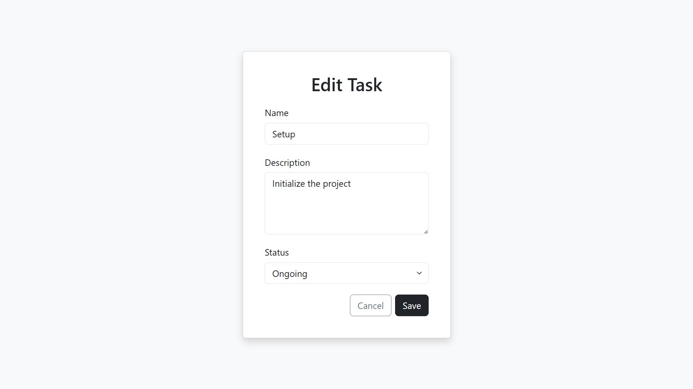

# Project Management Application

A full-stack MVC task management web application built with **Spring Boot, MySQL, and Thymeleaf**, enabling users to manage projects and tasks.

## Features

- **User Authentication:** Secure login and registration with password hashing using Java Security.
- **Project Management:** Create, edit, and delete projects, share projects with other users.
- **Task Management:** Add, update, and track tasks within projects.
- **Collaborative Work:** Shared projects allow multiple users to collaborate.
- **Validation & Error Handling:** Data integrity is ensured through form validations.
- **Responsive UI:** Views are built with Thymeleaf.

---

## Screenshots

### 1. User Registration

The registration page allows new users to create an account by entering their name, email, and password. Password confirmation ensures accurate input.

---

### 2. User Login

The login page grants registered users access to the application, with validation messages displayed for incorrect credentials.

---

### 3. Project List

The project list view displays all projects owned by the user and those shared with them. Users can view, edit, delete, or open projects to access detailed information and manage collaborators and tasks.

---

### 4. Project Creation

Users can create a new project by providing a title, description, and due date. The form includes validation to prevent missing or incorrect data.

---

### 5. Edit Project

The edit functionality utilizes the same form as creation but pre-fills it with existing details for both projects and tasks.

---

### 6. Task List

Opening a project provides a detailed view that displays all associated tasks and their respective status (ongoing or completed). This view enables users to manage tasks by adding, updating, or marking them as complete. Additionally, for owned projects, users have the option to add or remove collaborators.

---

### 7. Task Creation

Users can add new tasks to a project by specifying the task name, description, and status. Form validation ensures necessary fields are filled correctly.

---

### 8. Shared Projects

When opening the project as a collaborator, certain functionalities are restricted for security reasons; collaborators cannot view the email addresses of other collaborators and are unable to add or remove them. Collaborators have full access to manage tasks within the project but do not have the ability to edit or delete the project itself.

---

### 9. Delete Confirmation

Before deleting, the application prompts users for confirmation to prevent accidental deletions.

---

### 10. Error Handling

The application provides informative error messages to guide users in case of form validation errors.

---
